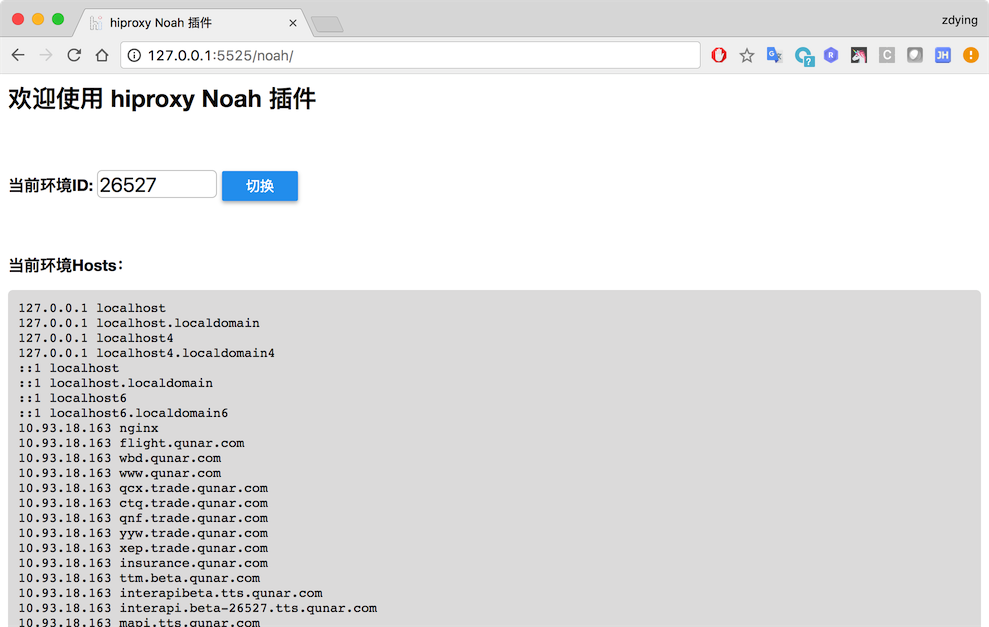

# hiproxy-plugin-noah

为hiproxy开发的Noah插件（只能在我们**内网**使用），可以根据Noah环境的ID，快速切换环境对应的hosts。

## 安装

* 安装hiproxy

```bash
npm install -g hiproxy
```

* 安装Noah插件

```bash
npm install -g hiproxy-plugin-noah
```

## 使用

### 直接使用envid启动

如果你已经知道了一套Noah环境的ID，你可以直接使用下面的命令启动hiproxy，传入ID。

```bash
# 26572  ==> 环境ID
# --open ==> 打开浏览器窗口并自动配置好代理
hiproxy noah 26572 --open
```

### 启动后再切换

如果你不喜欢使用envid启动，你可以使用一下步骤来使用Noah环境：

* 1、直接在**任意目录**启动hiproxy；
* 2、访问<http://127.0.0.1:5525/noah/>（这里使用了**默认端口: 5525**）；
* 3、输入`envid`；
* 4、点击`切换`按钮。

经过上面的步骤之后，页面会自动刷新，你能看到当前使用的hosts内容。

> **提示**： <br/>
> 1、不管使用上面两种方式中的哪一种启动，都可以在<http://127.0.0.1:5525/noah/>里面切换Noah环境。 <br/>
> 2、为了保证使用“纯净”的Noah环境，切换Noah环境时，会清空其他所有的hosts／rewrite配置。 

## 插件地址

<http://127.0.0.1:<port>/noah/>

## 截图



## 帮助信息

可以使用命令`hiproxy noah --help`来查看Noah插件的使用方法、参数等帮助信息。

```bash
USAGE:

  hiproxy noah <envid>

DESCRIBE:

  Start a proxy server and use Noah environment by an `envid`

OPTIONS:

  -h, --help                    show help info
  -s, --https                   Enable HTTPS proxy
  -m, --middle-man-port <port>  The HTTPS proxy port, default: 10010
  -o, --open [browser]          Open a browser window and use hiproxy proxy
  --pac-proxy                   Use Proxy auto-configuration (PAC)
  -p, --port <port>             HTTP proxy port, default: 5525
  --sys-proxy <path>            Your own proxy server path, format: <ip>[:port], only works when use PAC
```

## License

该插件采用MIT协议，点击[LICENSE](https://github.com/hiproxy/hiproxy-plugin-noah/blob/master/LICENSE)查看详情。
